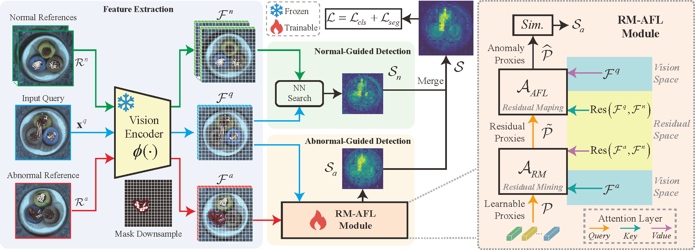

# [Normal-Abnormal Guided Generalist Anomaly Detection](https://arxiv.org/abs/2510.00495)
PyTorch implementation for our NeurIPS 2025 paper, Normal-Abnormal Guided Generalist Anomaly Detection.

<!-- [**Normal-Abnormal Guided Generalist Anomaly Detection**](https://arxiv.org/abs/2510.00495) -->

<!-- Yuexin Wang, Xiaolei Wang, Yizheng Gong, Jimin Xiao -->


>**Overview of our proposed framework.** Given a test image and its corresponding reference images (normal and abnormal), features are extracted through a pre-trained backbone network. The extracted normal features guide the generation of a normal-guided score map. Meanwhile, abnormal features are processed through the RM-AFL module to produce an abnormal-guided score map. This module implements a transformation process: from learnable proxies in vision space to residual proxies capturing normal-abnormal differences in residual space, and finally to anomaly proxies in vision space that highlight specific anomalous regions in the query image. The final anomaly score is computed by merging both normal and abnormal guided score maps.

***Abstrat:*** Generalist Anomaly Detection (GAD) aims to train a unified model on an original domain that can detect anomalies in new target domains. Previous GAD methods primarily use only normal samples as references, overlooking the valuable information contained in anomalous samples that are often available in real-world scenarios. To address this limitation, we propose a more practical approach: normal-abnormal-guided generalist anomaly detection, which leverages both normal and anomalous samples as references to guide anomaly detection across diverse domains. We introduce the Normal-Abnormal Generalist Learning (NAGL) framework, consisting of two key components: Residual Mining (RM) and Anomaly Feature Learning (AFL). RM extracts abnormal patterns from normal-abnormal reference residuals to establish transferable anomaly representations, while AFL adaptively learns anomaly features in query images through residual mapping to identify instance-aware anomalies. Our approach effectively utilizes both normal and anomalous references for more accurate and efficient cross-domain anomaly detection. Extensive experiments across multiple benchmarks demonstrate that our method significantly outperforms existing GAD approaches. This work represents the first to adopt a mixture of normal and abnormal samples as references in generalist anomaly detection.

## Usage

### Environment Setup
```bash
# python 3.10, torch 2.1.1+cu118
git clone https://github.com/JasonKyng/NAGL.git
pip install -r requirements.txt
```

### Dataset Preparation
1. Please download MVTecAD dataset from [MVTecAD dataset](https://www.mvtec.com/de/unternehmen/forschung/datasets/mvtec-ad/), VisA dataset from [VisA dataset](https://amazon-visual-anomaly.s3.us-west-2.amazonaws.com/VisA_20220922.tar), BTAD dataset from [BTAD dataset](http://avires.dimi.uniud.it/papers/btad/btad.zip), and MVTec3D dataset from [MVTec3D dataset](https://www.mvtec.com/company/research/datasets/mvtec-3d-ad), MPDD dataset from [MPDD dataset](https://github.com/stepanje/MPDD), MVTecLOCO dataset from [MVTecLOCO dataset](https://www.mvtec.com/company/research/datasets/mvtec-loco), BraTS dataset from [BraTS dataset](https://www.kaggle.com/datasets/dschettler8854/brats-2021-task1), RealIAD from [RealIAD dataset](https://realiad4ad.github.io/Real-IAD/), and etc. 
2. Convert the dataset to MVTecAD structure, the folder structure should be like:
   ```
   /path/to/dataset
    └── dataset_name_1
        ├── class_1
        │   ├── train
        │   │   ├── 000.png
        │   │   ├── 001.png
        │   │   └── ...
        │   ├── test
        │   │   ├── good
        │   │   │   ├── 000.png
        │   │   │   ├── 001.png
        │   │   │   └── ...
        │   │   ├── anomaly_type_1
        │   │   │   ├── 000.png
        │   │   │   ├── 001.png
        │   │   │   └── ...
        │   │   └── ...
        │   └── ground_truth
        │       ├── anomaly_type_1
        │       │   ├── 000.png
        │       │   ├── 001.png
        │       │   └── ...
        │       └── ...
        ├── class_2
        └── ...
    └── dataset_name_2
    └── ...
   ```
   For example, covert VisA dataset to MVTecAD structure by running (details in [this link](https://github.com/amazon-science/spot-diff?tab=readme-ov-file#data-preparation)):
   ```bash
   python dataset_preparation/convert_visa_to_mvtec.py
   ```
3. Genrate dataset json files (meta.json) for training:
    ```bash
    python dataset_preparation/mvtec.py
    python dataset_preparation/visa.py
    # ...
    ```
> **Note:** The dataset collection process is implemented in python class [`FSDataset`](./utils/dataset.py). And we also provide detailed instructions in **Appendix A** of our paper.

>*We currently recommend using the MVtecAD and VisA datasets. Full processing for other datasets (BraTS, MPDD, MVTec3D, ...) will be provided soon.*

### Training and Evaluation

```bash
# fold = 0: val on mvtec, training on visa; fold = 1: val on visa, training on mvtec
CUDA_VISIBLE_DEVICES=0 torchrun --nproc_per_node=1 --master_port=1024 train.py \
  --data_root /path/to/dataset \
  --fold 0 \ # 0 or 1
  --epoch 20 \
  --batch_size 8 \
  --image_size 448 \
  --print_freq 50 \
  --n_shot 1 \
  --a_shot 1 \
  --num_learnable_proxies 25 \
  --save_path ./outputs/train_on_visa
````

### Testing
```bash
CUDA_VISIBLE_DEVICES=0 python test.py \
    --save_path ./outputs/train_on_visa \
    --image_size 448 \
    --dataset MVTec \
    --n_shots 1 \
    --a_shots 1 \
    --num_learnable_proxies 25 \
    --num_seeds 3 \
    --eval_segm \
    --tag default \
    --data_root /path/to/dataset/mvtec
```

### (Optional)
After dataset preparation, you can also run the code in one-step:
```bash
sh run.sh train 0 ./outputs/train_on_visa 0 mvtec # mode, gpu_ids, ckpt_save_dir, fold, test_dataset
```
or
```bash
sh run.sh train 0 ./outputs/train_on_mvtec 1 visa
# directly test on other datasets
sh run.sh test 0 ./outputs/train_on_mvtec 1 btad
sh run.sh test 0 ./outputs/train_on_mvtec 1 brats
``` 

Using the following command to convert `json` results into `xlsx` results, for easy viewing.
```bash
python scripts/get_xlsx_result.py
```

## Citation
If you find this repository useful, please consider citing our work:
```bibtex
@inproceedings{wang2025normal,
  title={Normal-Abnormal Guided Generalist Anomaly Detection},
  author={Wang, Yuexin and Wang, Xiaolei and Gong, Yizheng and Xiao, Jimin},
  booktitle={The Thirty-Ninth Annual Conference on Neural Information Processing Systems},
  year={2025}
}
```

## Acknowledgement
We thank the great works [InCTRL](https://github.com/mala-lab/InCTRL), [ResAD](https://github.com/xcyao00/ResAD), [AnomalyDINO](https://github.com/dammsi/AnomalyDINO), [AnomalyCLIP](https://github.com/zqhang/AnomalyCLIP), and [WinCLIP](https://github.com/zqhang/Accurate-WinCLIP-pytorch) for assisting with our work.

## License
The code and dataset in this repository are licensed under the [MIT license](https://mit-license.org/).